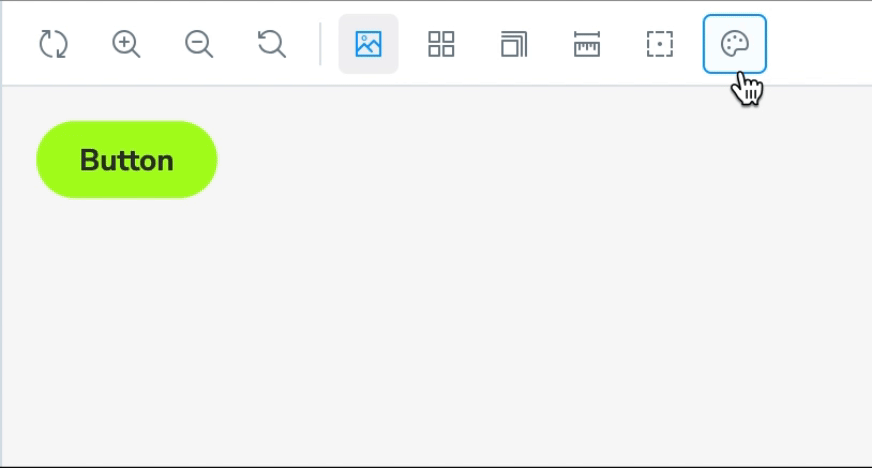

# Storybook Addon Theme Provider

[](https://storybook.js.org/addons/storybook-addon-theme-provider)
[](https://www.npmjs.com/package/storybook-addon-theme-provider)
[](http://npm-stats.org/#/storybook-addon-theme-provider)
[](https://github.com/morewings/storybook-addon-theme-provider)
[](https://github.com/morewings/storybook-addon-theme-provider)


> **Maintainer's personal appeal to the users** <br /><br />
> Hi, my name is Dima. I created this Storybook add-on. Thanks for choosing it for your project. Hope it helps you to achieve your goals and implement your ideas.<br /><br />
 At this moment I'm looking for as job as a **Lead/Senior Front Developer in Berlin, Germany**. So I would like to ask you to **refer me to your company** if this is relevant to your case. Here you can find my [CV and portfolio](https://linktr.ee/morewings). In case it is not relevant, giving a star 🌟 to add-on [repo](https://github.com/morewings/storybook-addon-theme-provider) is also appreciated. I believe that having a popular open source project is helpful for a job search.<br /><br />
 Thanks and happy coding!


Addon to manage global themes provided by Styled components, Emotion or any other solution based on React component, which receives prop `theme?: Record<string, unknown>` and children node(s). This addon is compatible with **Storybook versions 7 and 8**.

Inspired by [storybook-addon-themes](https://github.com/tonai/storybook-addon-themes).



## Install

1. Install addon with the package manager of your choice.

```shell
npm i -D storybook-addon-theme-provider
yarn add -D storybook-addon-theme-provider
pnpm i -D storybook-addon-theme-provider
```

2. Register addon in `.storybook/main.(js|ts)`

```js
export default {
    //...
    addons: [
        //...
        "storybook-addon-theme-provider",
        //...
    ],
};
```

## Use themes

Add decorator `withThemeProvider` to `.storybook/preview.(js|ts)`. This applies theme settings on **global level**.

```js
import {withThemeProvider} from 'storybook-addon-theme-provider';
import {Provider} from './Provider';

export default {
    //...
    decorators:[
        withThemeProvider(Provider),
        ///...
    ],
    globals: {
        // Set initially selected theme name
        selectedTheme: 'foo',
        // Provide a list of available themes
        themes: [
            {
                // Provide a name for the theme.
                name: 'foo',
                // Set a color to display after theme name
                color: 'red',
                // Provide object with foo theme data
                themeObject: {
                    baseColor: 'red',
                    //...
                }
            },
            {
                name: 'bar',
                color: '#AAAAAA',
                themeObject: {
                    baseColor: 'green',
                }
            }
        ]
    },
    //...
}
```

It's also possible to enable decorator on story level.

```js
// some CSF story file

export const story = {
  decorators: [withThemeProvider(Provider)]
};
```

## Use `Provider` component

`Provider` is a React component which receives `theme` prop, containing selected theme object, and `children` nodes. See [Styled component theming](https://styled-components.com/docs/advanced#theming) or [Emotion
ThemeProvider](https://emotion.sh/docs/theming#themeprovider-reactcomponenttype).

Developer can use custom `Provider` component as well.

```tsx
import React, {ReactNode} from 'react';

export const Provider = <TTheme,>({children, theme}: {children?: ReactNode; theme?: TTheme}) => {
    // apply theme somehow
    console.log('theme', theme)
    return <div>{children}</div>
}
```


